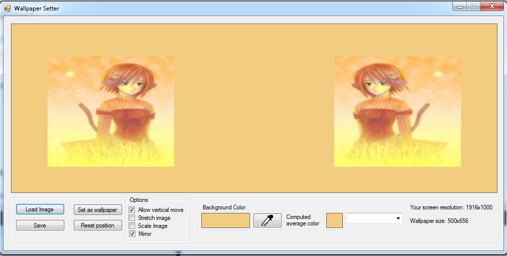

A simple program that lets you change the visible portion of a wallpaper so I you can get the canvas that you want to see.

It's very handy, especially when using minimalist wallpapers, or if the wallpaper is larger than your screen.

__Modifications in this fork:__

1. The main window is now resizable.
2. Handle images with weird DPI values.
3. Add true 'scale' in addition to existing 'stretch' mode.
4. 'Dominant' color is actually 'average' color.
5. Added combobox to pick from *most used* colors.
6. Added 'mirror'. Two copies of the input wallpaper, with one flipped horizontally.

Screen cap showing the current UI and mirror in action:

Original Example below:

